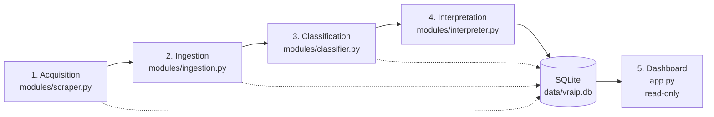

# VRAIP — Volcanic Risk AI Pipeline

 

VRAIP is a pipeline that scrapes official volcanic activity bulletins published by
Ecuador's Instituto Geofísico (IG-EPN), extracts and classifies the technical data they
contain, and uses a generative AI model (Gemini) to translate the result into
plain-language, citizen-facing alerts in Spanish. Every stage persists its output to a
local SQLite database, which a read-only Streamlit dashboard then presents. **VRAIP does
not independently assess volcanic risk.** It translates the alert level the IG-EPN has
already declared into language a non-expert can act on; the classification and alert
level always trace back to the source bulletin. This distinction — translation, not
assessment — is a deliberate design decision, documented in Chapter 4 of the
accompanying capstone report.

## Context and motivation

Communities living near Ecuador's active volcanoes depend on IG-EPN bulletins to know
when conditions change, but those bulletins are written in technical language (alert
levels, seismic activity types, column heights in meters above the crater) that is not
immediately actionable for someone deciding whether to evacuate, wear a mask, or simply
keep going about their day. VRAIP addresses that gap by automating the acquisition of
each new bulletin and generating a short, plain-language explanation and a set of
concrete preventive recommendations alongside the original technical classification.
This project was developed as a capstone for the BSc in Computer Science at MIU City
University Miami.

## Architecture overview

The pipeline runs as four sequential stages, each writing to its own SQLite table, with
the database acting as shared state between them. A fifth component, the Streamlit
dashboard, reads that same database but never writes to it.



Each stage function returns the ID of the row it just created, which becomes the input
to the next stage. `main.py` chains all four stages per volcano and isolates failures so
that one volcano's error never stops the others.

1. **Acquisition** — drives headless Chrome (Selenium) against the IG-EPN bulletin
   search form, filters results down to PDF-type reports (the results list also contains
   PNG infographics), and downloads the newest PDF. Falls back to a bundled sample PDF if
   the live scrape fails for any reason.
2. **Ingestion** — extracts raw text from the PDF (`pdfplumber`) and stores it in the
   `bulletins` table, together with the source URL and an ingestion timestamp.
3. **Classification** — a pure regex engine over the Spanish bulletin text; no LLM is
   involved at this stage. Extracts the alert level, surface/internal activity,
   ash/gas/incandescence flags, lahar detection, explosion counts, and maximum eruptive
   column height, and stores them in `classifications`.
4. **Interpretation** — sends the classified data to Gemini, requesting a two-part
   Spanish response (`EXPLICACIÓN:` / `RECOMENDACIONES:`), and stores the result in
   `ai_alerts`. Falls back to a canned explanation if every model call fails (e.g. quota
   errors).
5. **Dashboard** (`app.py`) — a read-only Streamlit application that joins all four
   tables and presents them as a national status map and per-volcano detail views.

## Features

- Multi-volcano orchestration: `main.py` iterates over every seeded volcano in one
  invocation, with per-volcano error isolation — a failure processing one volcano is
  logged and does not stop the run for the others.
- Live scraping with PDF-vs-infographic filtering: the IG-EPN results list mixes PDF
  reports and PNG infographics under an identical UI, so the scraper inspects each row's
  type badge and downloads only the newest PDF-type report.
- Rule-based risk classification with an explicit-detection flag
  (`alert_level_detected`): when no alert-level keyword is found in the bulletin text,
  the classifier still emits a default level but marks it as not explicitly detected,
  rather than silently guessing.
- AI-generated citizen alerts with cascading model fallback: the interpreter tries
  `gemini-3.6-flash` then `gemini-2.5-flash`, and falls back to a pre-written Spanish
  explanation/recommendation pair if both API calls fail.
- Historical batch-ingestion path (`scripts/ingest_historical.py`) for volcanoes with
  sparse live publication: it runs Stages 2–4 only (no scraping, no network) over
  manually downloaded PDFs, so a historical sample can be built without waiting on
  IG-EPN's publication cadence.
- Two-view Streamlit dashboard: a main panel (summary metrics, a Plotly map of Ecuador,
  per-volcano status cards) and a per-volcano detail view (AI explanation,
  recommendations, alert-level history chart, source reference).

## Tech stack

| Component | Technology | Role |
|---|---|---|
| Web automation | `selenium`, `webdriver-manager` | Drives headless Chrome against the IG-EPN bulletin search form and downloads PDFs |
| PDF parsing | `pdfplumber` | Extracts raw text from downloaded bulletin PDFs |
| Database | `sqlite3` (standard library) | Persists bulletins, classifications, and AI alerts locally |
| Data handling | `pandas` | Backs the read-only dashboard query helpers |
| AI interpretation | `google-genai` (Gemini API) | Generates the citizen-facing Spanish explanation and recommendations |
| Configuration | `python-dotenv` | Loads `GEMINI_API_KEY` and other environment variables from `.env` |
| Dashboard | `streamlit` | Read-only presentation layer over the SQLite database |
| Visualization | `plotly` | National status map and alert-level history charts in the dashboard |
| Testing | `pytest` | Offline unit tests plus a separately marked integration suite |

## Repository structure

```
main.py                     Pipeline entry point; orchestrates all four stages per volcano
app.py                      Streamlit dashboard (read-only) over data/vraip.db
style.css                   Alert-level badge styling injected by app.py
modules/
  scraper.py                 Stage 1 — Selenium-based bulletin acquisition, with fallback
  ingestion.py                Stage 2 — PDF text extraction and bulletins table insert
  classifier.py               Stage 3 — regex-based risk classification
  interpreter.py              Stage 4 — Gemini-based citizen alert generation, with fallback
database/
  db.py                        SQLite schema, seeding, connection, and read-only dashboard query helpers
scripts/
  ingest_historical.py         Batch-ingests manually downloaded PDFs through Stages 2–4 only
tests/
  test_classifier.py           Offline unit tests for the regex classification engine
  test_interpreter.py          Interpreter tests (includes one integration-marked test)
  test_scraper.py              Scraper tests (includes one integration-marked test)
  conftest.py                  Registers the `integration` pytest marker; fixes sys.path
data/                         Downloaded PDFs, the bundled fallback PDF, and vraip.db (gitignored)
logs/                         Timestamped run logs written by main.py and ingest_historical.py
requirements.txt              Python dependencies
.env.example                  Template for the required GEMINI_API_KEY
```

## Setup and installation

```bash
# 1. Clone the repository
git clone <repository-url>
cd VRAIP

# 2. Create and activate a virtual environment
python -m venv .venv
source .venv/bin/activate      # on Windows: .venv\Scripts\activate

# 3. Install dependencies
pip install -r requirements.txt

# 4. Configure the Gemini API key
cp .env.example .env
# then edit .env and set GEMINI_API_KEY to a valid key

# 5. Initialize the database (creates data/vraip.db and seeds the volcanoes table)
python database/db.py
```

Step 5 must be run explicitly — `database/db.py` only initializes and seeds the database
when executed directly (`if __name__ == "__main__"`), not merely by being imported.
`modules/interpreter.py` also raises a `ValueError` at import time if `GEMINI_API_KEY` is
missing or left as its placeholder value, so `.env` must be populated before running
anything that imports it: the interpreter module itself, `main.py`, or
`tests/test_interpreter.py`.

## Usage

**Full pipeline, every seeded volcano:**

```bash
python main.py
```

```
==================================================
 VRAIP: VOLCANIC RISK AI PIPELINE - SYSTEM START
==================================================

##################################################
 PROCESSING VOLCANO: Cotopaxi (ID: 1)
##################################################

[>>> STAGE 1: DATA SCRAPING <<<]
...
[✓] PIPELINE SUCCESSFULLY COMPLETED

==================================================
 RUN SUMMARY
==================================================
 Volcanoes processed: 4
 Succeeded:           4
 Failed:              0
```

**Single volcano:**

```bash
python main.py --volcano Sangay
```

**Historical batch ingestion** (Stages 2–4 only, no scraping — for volcanoes whose live
publication cadence is too sparse to build a sample by waiting):

```bash
python scripts/ingest_historical.py --folder data/historical
```

The target folder needs a `manifest.csv` mapping each PDF filename to the volcano it
belongs to:

```csv
filename,volcano_name
reventador_informe_220.pdf,Reventador
sangay_informe_018.pdf,Sangay
```

```
[*] 2 bulletin(s) listed in the manifest.

##################################################
 [1/2] reventador_informe_220.pdf -> Reventador (manifest line 2)
##################################################
[>>> STAGE 2: TEXT EXTRACTION <<<]
...
[✓] HISTORICAL BULLETIN INGESTED
```

**Dashboard:**

```bash
streamlit run app.py
```

This opens a browser tab with the main panel (summary metrics, national map, per-volcano
status cards) and a sidebar toggle to a per-volcano detail view.

## Testing

The suite currently totals 29 tests: 27 run fully offline, and 2 are marked
`integration` because they require live network access and a valid `GEMINI_API_KEY`
(one exercises the real IG-EPN scraper, the other a live Gemini call).

```bash
python -m pytest                       # all 29 tests (integration tests need network + API key)
python -m pytest -m "not integration"  # 27 offline tests only
```

## Known limitations

- **`bulletins.published_at` is the ingestion timestamp**, not the bulletin's own stated
  publication date. Dashboard date axes and labels are captioned "fecha de ingesta" for
  this reason.
- **`bulletins.source_url` is the IG-EPN portal's search entry point**, not a
  per-document permalink — the portal does not expose stable links to individual
  bulletins.
- **Output is Spanish-only.** The AI interpretation prompt explicitly forces Spanish
  output, and all citizen-facing dashboard text is Spanish per the capstone's
  non-functional requirements.
- **IG-EPN's publication cadence varies by volcano and by activity level.** Empirically,
  during the evaluation period Reventador and Sangay published daily PDF reports during
  active phases, Cotopaxi published monthly, and Tungurahua published no PDF reports at
  all — only PNG infographics, which the scraper deliberately does not treat as a
  substitute for a PDF report.
- **SQLite serializes writes.** This is not a problem for the current sequential,
  single-process pipeline, but it would become a constraint if concurrent multi-volcano
  ingestion were added later.

## Academic context

VRAIP is a capstone project for the BSc in Computer Science at MIU City University
Miami, developed under Design Science Research Methodology and supervised by
Dr. Tony Prensa.

## License / attribution

This is an academic capstone project. No open-source license has been applied to this
repository at this time.
